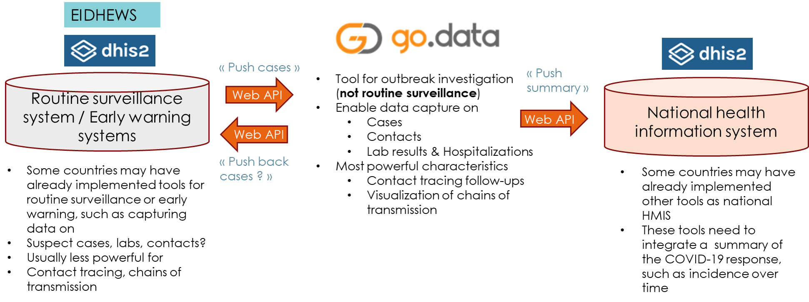

## interoperability-app
DHIS2 basic app to allow interoperability between DHIS2 and Go.Data instances


## Requirements

+ Node.js (>= v12.x) and npm (>= v6.x) installed in the system.

## Installation

+ Clone the repository or download it as a zip file.
+ In a terminal, install the dependencies by executing ```npm install``` inside the project folder.
+ In a terminal, run the command ```npm run build``` or ```yarn build``` to build the app for production into the `build` folder.
+ Compress the `build` folder, go to the App Management app inside your DHIS2 instance and upload the compressed .zip.
