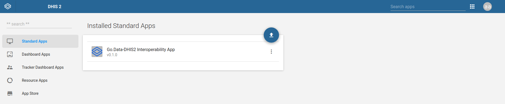

## Go.Data-DHIS2 Interoperability App
DHIS2 basic app to allow interoperability between DHIS2 and Go.Data instances

## Installation

+ Download the app.zip file <a href="https://github.com/WISCENTD-UPC/godata-dhis2-interoperability-app/files/5965231/app.zip">here</a>.
+ Go to the *App Management* app inside your DHIS2 instance and upload the .zip file.

## App Functionality

+ **Import Credentials**: The first thing that needs to be configured is the connection to both DHIS2 and Go.Data APIs. A base endpoint has to be provided for each service, as well as the credentials needed for the authentication. Once the form is submitted, the information will be saved on the DHIS2 Data Store.

    

+ **Base configuration settings**: To adapt the process to a specific DHIS2 structure, configurable parameters settings must be provided. There are also additional parameters related to outbreak creation and configuration. Once the form is submitted, the information will be saved on the DHIS2 Data Store.

    

+ **Export data and metadata**: There are two possible export sequences. Both ways are equivalent, the only difference is that the *Full transfer* sequence groups *Copy Metadata*, *Create outbreaks*, *Copy cases* and *Copy contacts* all in one step. 
    + Copy Organisation Units: At the end of this step, a pop-up window will appear to download the orgUnits `.json`. This file needs to be saved on the computer and imported on the Go.Data instance following the path:  
    `Go.Data → Locations → Quick Actions → Import hierarchical locations → Choose file (organisation-units.json) → Import`    

    

    Once this file has been correctly imported, carry on with the next steps. Before moving on to the next step, all the pop-up messages have to be checked as done (✓).

    

